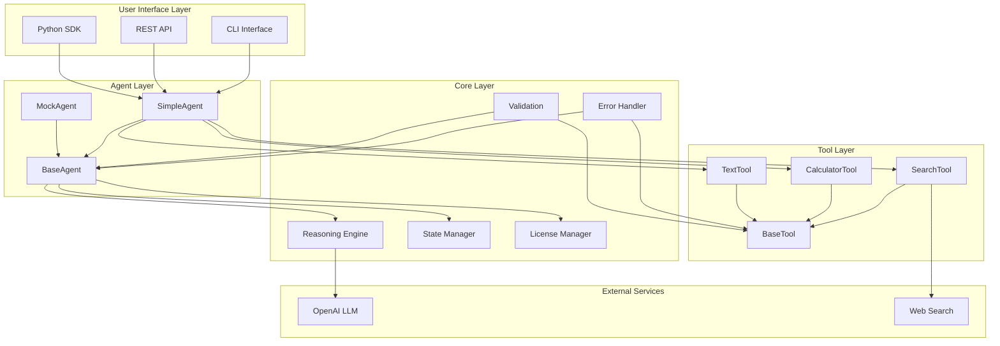
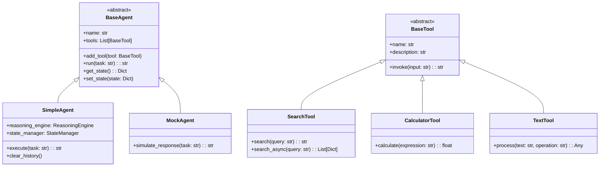
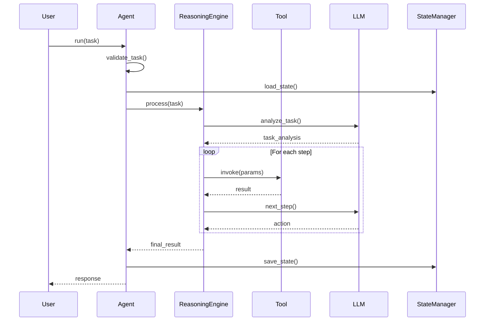
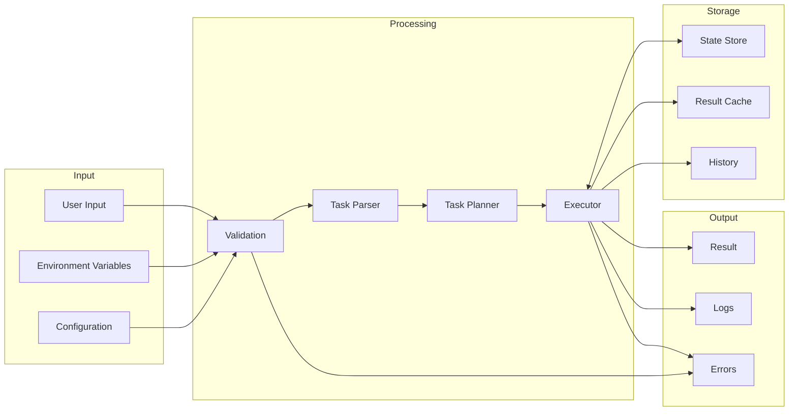
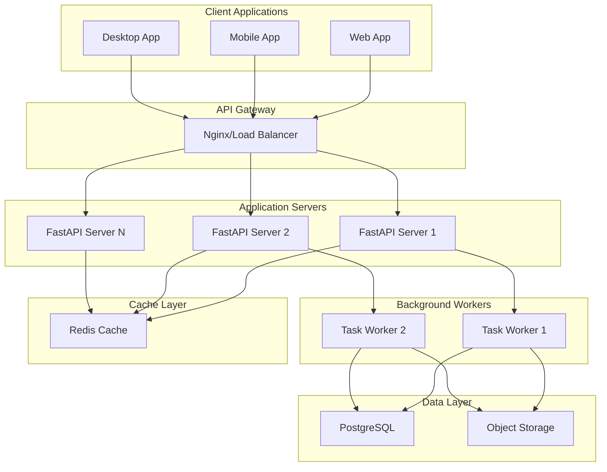
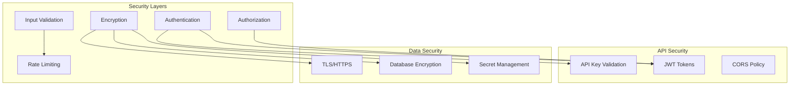

# Architecture Overview

This document provides architectural diagrams and explanations of the Agentic Framework Community Edition.

## High-Level System Architecture

## Class Hierarchy

## Task Execution Flow

## Data Flow Diagram

## Component Responsibilities

### Agent Layer
- **BaseAgent**: Abstract base class defining the agent interface
- **SimpleAgent**: Main implementation with basic sequential reasoning
- **MockAgent**: Testing implementation that doesn't require API keys

### Tool Layer
- **BaseTool**: Abstract base class for all tools
- **SearchTool**: Web search functionality (DuckDuckGo in community edition)
- **CalculatorTool**: Mathematical calculations and expressions
- **TextTool**: Text processing and manipulation

### Core Layer
- **Reasoning Engine**: Processes tasks and determines execution steps
- **State Manager**: Handles agent state persistence and recovery
- **License Manager**: Manages feature availability based on edition
- **Error Handler**: Centralized error handling and recovery
- **Validation**: Input validation and sanitization

### External Services
- **OpenAI LLM**: Language model for task understanding and generation
- **Web Search**: External search services (DuckDuckGo, Google, etc.)

## Deployment Architecture

## Security Architecture

## Scaling Considerations

### Horizontal Scaling
- Stateless API servers allow easy horizontal scaling
- Background workers can be scaled based on queue depth
- Redis provides distributed caching

### Vertical Scaling
- Async/await support for better resource utilization
- Connection pooling for external services
- Efficient memory management for long conversations

### Performance Optimizations
- Result caching for expensive operations
- Lazy loading of tools and models
- Batch processing for multiple requests
- Query optimization for search operations

## Future Architecture (Enterprise Edition)

The enterprise edition extends the architecture with:
- Multi-agent orchestration
- Advanced reasoning with self-reflection
- Game theory integration
- Support for multiple LLM providers
- Enhanced security features
- Custom plugin system
- Distributed task execution
- Advanced monitoring and analytics
